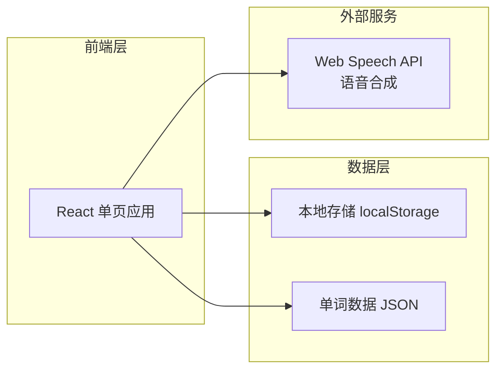

# 英语六级单词游戏学习平台 - 技术架构文档

## 1. 架构设计

### 1.1 系统架构图



### 1.2 技术选型

- **前端框架**：React 18 + Vite
- **样式方案**：Tailwind CSS + 自定义CSS变量
- **状态管理**：React useState + useContext
- **数据存储**：localStorage（本地持久化）
- **语音服务**：Web Speech API（浏览器原生）
- **图标**：Lucide React
- **动画**：CSS动画 + Framer Motion

## 2. 路由设计

| 路由 | 页面名称 | 功能描述 |
|-----|---------|---------|
| `/` | 首页 | 学习概览、模式选择、快速开始 |
| `/game/:mode` | 游戏页 | 单词练习、游戏交互 |
| `/progress` | 进度页 | 学习统计、错题本 |
| `/achievements` | 成就页 | 徽章展示、成就系统 |

## 3. 数据模型

### 3.1 单词数据结构

```typescript
interface Word {
  id: number;
  word: string;          // 英文单词
  phonetic: string;      // 音标
  meaning: string;       // 中文释义
  example: string;       // 例句
}
```

### 3.2 用户进度数据结构

```typescript
interface UserProgress {
  totalLearned: number;        // 已学单词数
  correctCount: number;         // 正确次数
  wrongCount: number;           // 错误次数
  streakDays: number;          // 连续学习天数
  lastStudyDate: string;       // 最后学习日期
  wrongWords: number[];        // 错题单词ID列表
  achievements: string[];       // 已获得成就ID列表
}
```

### 3.3 游戏记录数据结构

```typescript
interface GameRecord {
  mode: string;           // 游戏模式
  score: number;         // 本轮得分
  total: number;         // 总题数
  correct: number;        // 正确数
  date: string;          // 游戏日期
}
```

## 4. 核心组件设计

### 4.1 组件结构

```
src/
├── components/
│   ├── Layout/
│   │   ├── Header.jsx         # 顶部导航栏
│   │   └── Navigation.jsx     # 底部导航（移动端）
│   ├── Home/
│   │   ├── StatsCard.jsx      # 统计卡片
│   │   ├── ModeCard.jsx       # 游戏模式选择卡片
│   │   └── QuickStart.jsx     # 快速开始按钮
│   ├── Game/
│   │   ├── QuestionDisplay.jsx    # 题目展示
│   │   ├── OptionButton.jsx       # 选项按钮
│   │   ├── GameTimer.jsx          # 计时器
│   │   ├── ScoreDisplay.jsx       # 得分显示
│   │   └── GameResult.jsx         # 游戏结果
│   ├── Progress/
│   │   ├── StatCard.jsx       # 统计卡片
│   │   ├── WrongWordsList.jsx # 错题列表
│   │   └── ProgressChart.jsx  # 进度图表
│   └── Achievements/
│       ├── BadgeGrid.jsx      # 徽章网格
│       └── BadgeCard.jsx      # 单个徽章
├── pages/
│   ├── HomePage.jsx           # 首页
│   ├── GamePage.jsx           # 游戏页
│   ├── ProgressPage.jsx        # 进度页
│   └── AchievementsPage.jsx   # 成就页
├── context/
│   └── GameContext.jsx        # 游戏状态上下文
├── data/
│   └── words.js               # 单词数据
├── hooks/
│   ├── useGame.js             # 游戏逻辑钩子
│   └── useSpeech.js           # 语音合成钩子
└── utils/
    └── storage.js              # 本地存储工具
```

## 5. 游戏模式详细设计

### 5.1 单词速识模式

- 展示：英文单词（大字居中）
- 选项：4个中文释义
- 判断：选择正确释义
- 计分：答对+10分，连击加成

### 5.2 释义匹配模式

- 展示：中文释义
- 选项：4个英文单词
- 判断：选择正确单词
- 计分：答对+10分，连击加成

### 5.3 听音辨词模式

- 展示：播放发音按钮
- 选项：4个英文单词（显示）
- 判断：选择听到的单词
- 计分：答对+15分（听音难度更高）

### 5.4 拼写挑战模式

- 展示：播放发音
- 输入：文本输入框
- 判断：拼写正确（忽略大小写）
- 计分：完全正确+20分，部分正确+5分

## 6. 成就系统设计

| 成就ID | 名称 | 条件 | 图标 |
|-------|------|------|------|
| first_learn | 初出茅庐 | 完成第一次学习 | 🌟 |
| streak_3 | 三天打鱼 | 连续学习3天 | 🔥 |
| streak_7 | 一周坚持 | 连续学习7天 | 💪 |
| streak_30 | 月度达人 | 连续学习30天 | 👑 |
| perfect_10 | 满分选手 | 单轮10题全对 | 🎯 |
| words_100 | 词汇百例 | 学习100个单词 | 📚 |
| words_500 | 词汇五百 | 学习500个单词 | 🏆 |
| words_1000 | 词汇千例 | 学习1000个单词 | 🌈 |
| combo_5 | 五连绝世 | 连续答对5题 | ⚡ |
| combo_10 | 十连绝伦 | 连续答对10题 | 🚀 |

## 7. 性能优化策略

- 路由懒加载：React.lazy + Suspense
- 图片优化：使用CSS渐变替代图片背景
- 动画优化：使用transform和opacity进行动画
- 数据缓存：localStorage缓存用户进度
- 防抖处理：输入框防抖验证
